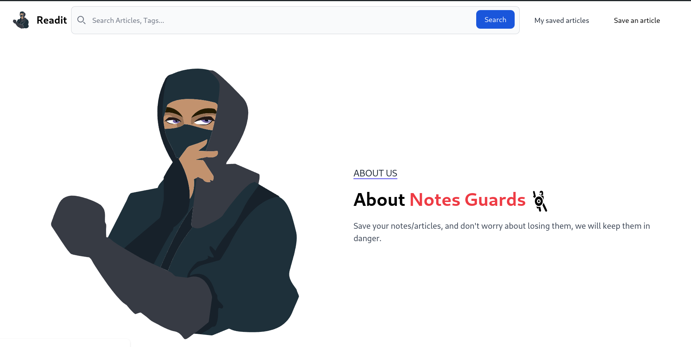
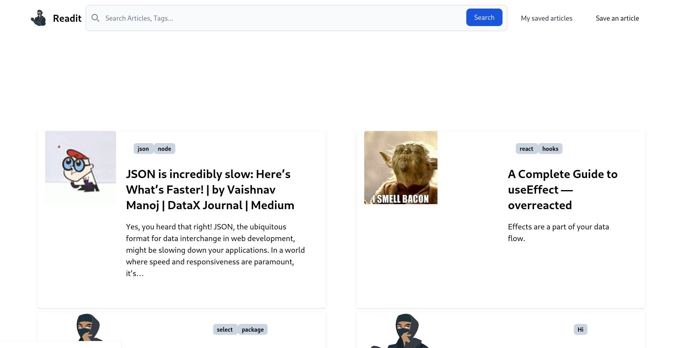

**Readit-Later** a simple web site aims to save your favourties articles, web pages to read them later.

## Features

- Save your favourite articles, web pages into database. (URL, Title, Content)
- Read saved articles, web pages.
- Delete saved articles, web pages.

### Incoming Features

- [x] Tags for classify saved articles, web pages.
- [x] Search saved articles, web pages.
- [ ] save articles in favorite bin, archive bin, reading bin.
- [ ] Fixing some Paths and URL issues. (using Absolute paths)
- [ ] Recursively save articles, web pages. (Save all links in the page)
- [ ] Download resources (images, videos, etc.) in the local.
- [ ] Export saved articles, web pages as PDF, HTML, etc.

## Technologies

- Node.js/Express.js
- SQLite
- Nunjucks (Template Engine)
- Tailwindcss + flowbite (CSS Framework)

## Installation

1. Clone the repository

```bash
git clone <repository-url>
cd readit-later
```

2. Install dependencies

```bash
npm install
```

3. Run the app

```bash
npx tailwindcss -i ./public/style/input.css -o ./public/style/index.css --watch # for compiling tailwindcss
node index.js # for running the app
```

of if you want to run it in any place in your system by type only "readit" in the terminal to the following:

Linux/MacOS:

```bash
sudo ln -s /path/to/index.js /usr/local/bin/readit
```

after that you can do this:

```bash
readit
```

Windows:

1. Go to the directory where the **readit.bat** file is located.
2. Change the path in the **readit.bat** file to the path of the **index.js** file.
3. Add the **readit.bat** file to anywhere in your system.
4. then add the directory which contains the **readit.bat** file to the system path.

then you can run the app by typing "readit" in the terminal.

```bash
readit
```

5. Open your browser and navigate to `http://localhost:3001`
6. Enjoy!

### Preview

- About
  

- Articles
  
